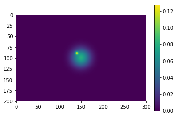
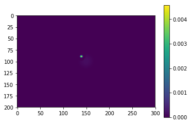
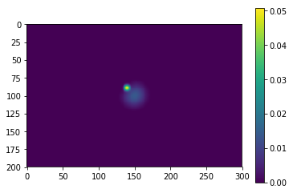
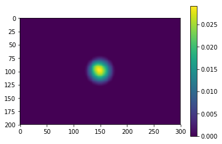
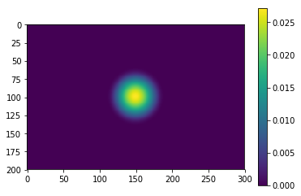
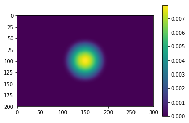

# Constrained diffusion decomposition: A new PDE-based image decomposition method


# General Design
A natural image often contains components of different scales. 

This project decomposition to numpy.ndarray data, decomposing it into scale components, or scales, 1, 2, 4, 8, 16, ... pixels, enabling multi-scale analysis. 

The code is based on 
<a href="https://arxiv.org/abs/2201.05484"> Li 2022, Multi-Scale Decomposition of Astronomical Maps -- Constrained Diffusion Method </a>.


Assuuming an input of I(x, y), the decomposition is achieved by solving the equation

```math
\frac{\partial I_t }{\partial t} ={\rm sgn}(I_t) \mathcal{H}({- \rm sgn}(I_t) \nabla^2 I_t) \nabla^2 I_t ;,
```
where t is related to the scale l by t = l**2.
 


# Installation


1. Use git clone
   ```bash
   git clone https://github.com/gxli/Constrained-Diffusion-Decomposition.git
   cd constrained_diffusion
   pip install .
   ```

2. Use pip

   ```bash
   pip install --upgrade scipy numpy 
   pip install -i https://test.pypi.org/simple/ constrained-diffusion==1.0.4
   ```

   https://test.pypi.org/project/constrained-diffusion/1.0.4/   

# Usage:

### Input:

numpy nd array, of shape e.g. (nx, ny, nz)

### Output:

result: numpy nd array, of shape (m, nx, ny, nz). The mth commponent contain structures of sizes 2$^(m-1)$ to 2$^m$ pixels. residual: numpy nd array, of shape (nx, ny, nz) the input data will be recovered as input = sum_i result[i] + residual


```python
import constrained_diffusion as cdd

result, residual = cdd.constrained_diffusion_decomposition(data)
```


# Example

```python
import matplotlib.pyplot as plt
from matplotlib import cm
import numpy as np
from astropy.io import fits
from constrained_diffusion import constrained_diffusion_decomposition

def multivariate_gaussian(pos, mu, Sigma):
    """Return the multivariate Gaussian distribution on array pos.

    pos is an array constructed by packing the meshed arrays of variables
    x_1, x_2, x_3, ..., x_k into its _last_ dimension.

    """

    n = mu.shape[0]
    Sigma_det = np.linalg.det(Sigma)
    Sigma_inv = np.linalg.inv(Sigma)
    N = np.sqrt((2*np.pi)**n * Sigma_det)

    fac = np.einsum('...k,kl,...l->...', pos-mu, Sigma_inv, pos-mu)

    return np.exp(-fac / 2) / N
```


```python
# Preparing sample input
N_x = 300
N_y = 200
X = np.linspace(0, 300, N_x)
Y = np.linspace(0, 200, N_y)
X, Y = np.meshgrid(X, Y)

mu = np.array([150., 100.])
Sigma = np.array([[200, 0], [0,  200]])

pos = np.empty(X.shape + (2,))
pos[:, :, 0] = X
pos[:, :, 1] = Y


Z1 = multivariate_gaussian(pos, mu, Sigma) * 100
Z3 = multivariate_gaussian(pos, mu - 10 , Sigma * 0.03) * 3

Z = Z1 + Z3

plt.figure()
plt.imshow(Z)
plt.colorbar()
plt.show()
```


    
<!--  -->
    



```python
# performing decomposition
result, residual = constrained_diffusion_decomposition(Z)
```

    ntot 6
    i = 0
    kernel_size 0.31622776601683794
    i = 1
    kernel_size 0.34641016151377546
    i = 2
    kernel_size 0.6928203230275509
    i = 3
    kernel_size 1.3856406460551018
    i = 4
    kernel_size 2.7712812921102037
    i = 5
    kernel_size 5.542562584220407


```python
# visualizing results
from pylab import *
for i in result:
    figure()
    imshow(i)
    colorbar()
```


    

    


    


    

    

    

  <!--    -->


## License
 See the [LICENSE](LICENSE) file for details.

