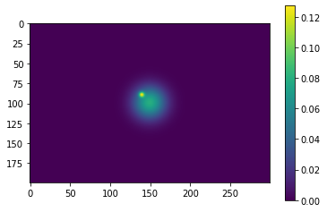
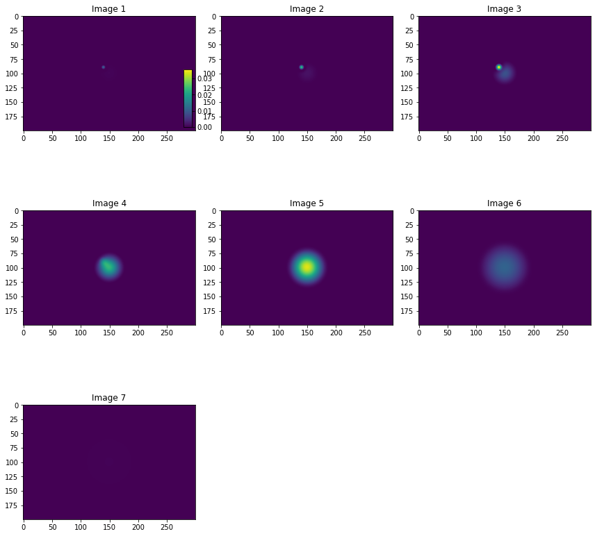
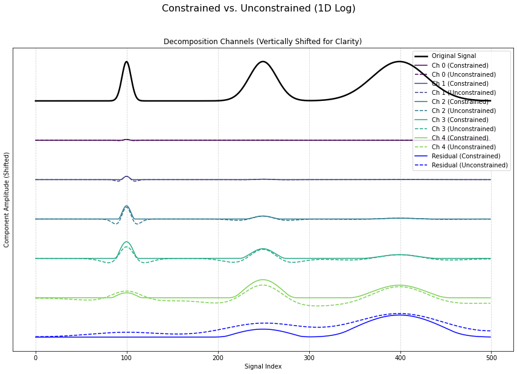
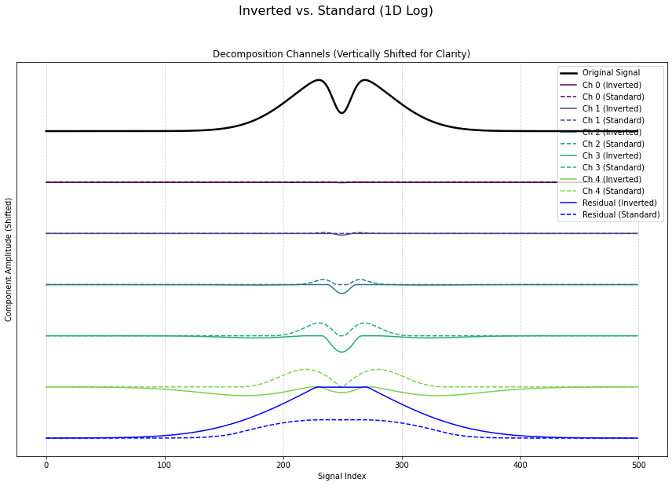
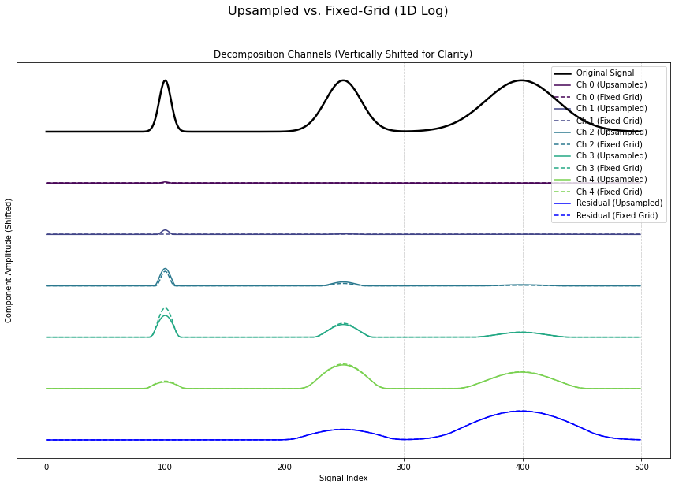
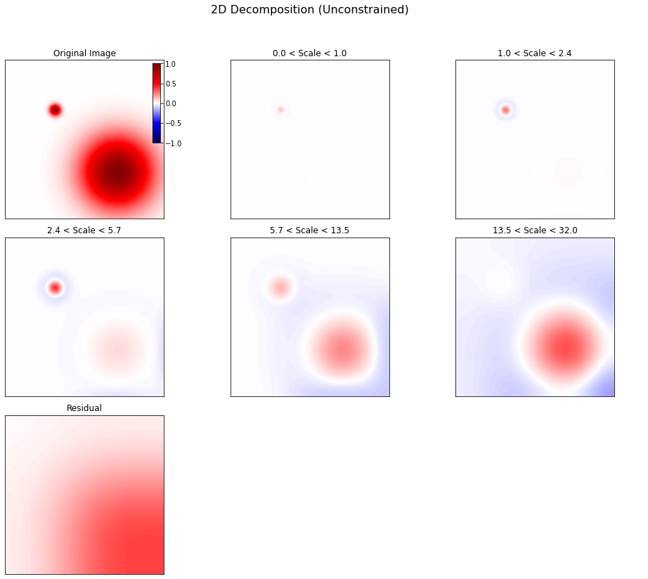
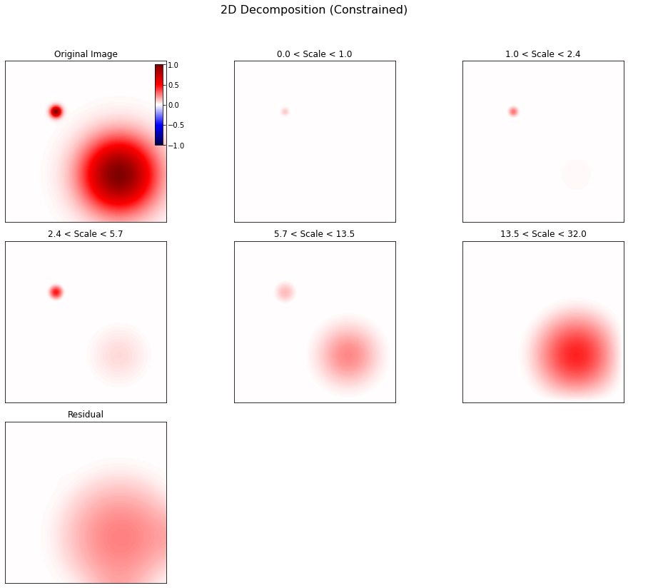

# Constrained Diffusion Decomposition: A PDE-based Image Decomposition Method

## General Design
A natural image often contains components of different scales. This project provides a powerful tool to decompose N-dimensional `numpy.ndarray` data into its constituent scale components.

The decomposition is highly flexible, allowing for **logarithmically** or **linearly** spaced scales that can be **automatically determined** from the data's shape or specified manually by the user.

The code is based on the principles described in
<a href="https://arxiv.org/abs/2_201.05484">Li 2022, Multi-Scale Decomposition of Astronomical Maps -- Constrained Diffusion Method</a>.

Assuming an input of I(x, y), the decomposition is achieved by solving the equation:

```math
\frac{\partial I_t }{\partial t} ={\rm sgn}(I_t) \mathcal{H}({- \rm sgn}(I_t) \nabla^2 I_t) \nabla^2 I_t
```
where the diffusion time `t` is related to the characteristic scale `l` by `t = l²/2`.

## Key Features

*   **Automatic Parameter Detection**: For ease of use, the decomposition scales (`min_scale`, `max_scale`) and the number of channels (`num_channels`) are automatically inferred from the input data's shape if not provided.
*   **Hybrid Upsampling Strategy**: For maximum accuracy and efficiency, the default (`up_sample=True`) mode uses a hybrid approach:
    1.  It performs a high-resolution (4x upsampled) decomposition for small scales (<= 5 pixels) to accurately capture fine details.
    2.  It then performs a standard decomposition on the residual for all larger scales.
*   **Constrained vs. Unconstrained Modes**:
    *   The default (`constrained=True`) uses a sign-based constrained algorithm that is guaranteed to be artifact-free and will not create new peaks or valleys.
    *   An optional `constrained=False` mode provides a standard linear diffusion decomposition, which is faster but may introduce "ringing" artifacts (negative halos around positive peaks).
*   **Inverted Decomposition**: A special `inverted=True` mode allows the algorithm to decompose negative features ("holes" or depressions) within a positive background, rather than the standard behavior of decomposing positive peaks.
*   **Fine-Grained Scale Control**: Advanced users can specify the `log_scale_base` or `linear_scale_step` to precisely control the spacing and number of decomposition channels.

## Installation

1.  **From source via git clone:**
    ```bash
    git clone https://github.com/gxli/Constrained-Diffusion-Decomposition.git
    cd Constrained-Diffusion-Decomposition 
    pip install .
    ```

2.  **Via `pip`:**
    ```bash
    pip install constrained-diffusion
    ```
3.  **Via `pip`:**
    ```bash
    pip install -i https://test.pypi.org/simple/ constrained-diffusion==1.2.2
     ```
## Usage

The main entry point is the highly automated `constrained_diffusion_decomposition` function.

### Function Signature
```python
constrained_diffusion_decomposition(
    data, 
    num_channels=None, 
    max_scale=None, 
    min_scale=1,
    mode='log', 
    log_scale_base=2.0,
    linear_scale_step=None,
    up_sample=True, 
    constrained=True,
    inverted=False,
    return_scales=False
)
```

### Key Parameters

| Parameter | Description | Default |
| :--- | :--- | :--- |
| `data` | The input N-dimensional NumPy array. | (Required) |
| `mode` | Scale spacing: `'log'` (powers of 2) or `'lin'` (linear). | `'log'` |
| `up_sample` | If `True`, uses the efficient hybrid upsampling strategy. | `True` |
| `constrained`| If `True`, uses the artifact-free constrained algorithm. | `True` |
| `inverted` | If `True`, decomposes depressions ("holes") instead of peaks. | `False` |
| `num_channels`| Number of channels. If `None`, calculated automatically. Ignored in linear mode if `linear_scale_step` is set. | `None` |
| `max_scale` | The largest scale to analyze. If `None`, set to `max(data.shape)/2`. | `None` |
| `min_scale` | The smallest scale to analyze. | `1` |
| `log_scale_base` | The base for logarithmic scale generation. Smaller values create finer scales. | `2.0` |
| `linear_scale_step`| If set, defines a fixed step size for linear mode, overriding `num_channels`.| `None` |
| `return_scales`| If `True`, returns the list of scales used for decomposition. | `False` |


### Input:

-   A `numpy.ndarray` of any shape, e.g., `(nx, ny, nz)`.

### Output:

-   By default, a tuple `(results, residual)`.
-   If `return_scales=True`, a tuple `(results, residual, scales)`.

Where:
-   **`results`**: A `list` of NumPy arrays. `results[i]` contains structures corresponding to `scales[i]`.
-   **`residual`**: A NumPy array containing structures larger than the largest scale.
-   **`scales`**: (Optional) The list of scale values used for the decomposition.

The original data can be perfectly recovered via: `data = np.sum(results, axis=0) + residual`.

### Quickstart

```python
import constrained_diffusion as cdd
import numpy as np

# Create some sample data
data = np.random.rand(128, 128) 

# Perform decomposition with default automatic settings
results, residual = cdd.constrained_diffusion_decomposition(data)

print(f"Decomposed into {len(results)} channels.")
```

## Example

This example decomposes an image containing two Gaussian structures of different sizes using the recommended default settings.

```python
import matplotlib.pyplot as plt
import numpy as np
from mpl_toolkits.axes_grid1.inset_locator import inset_axes

# Assuming 'result' is a list of 2D arrays
# Example: result = [np.random.rand(10, 10) for _ in range(6)]  # Dummy data for testing
n_images = len(result)
cols = 3  # Fixed number of columns
rows = int(np.ceil(n_images / cols))  # Calculate required rows

# Determine the global min and max for the shared color scale
vmin = min(np.min(img) for img in result)
vmax = max(np.max(img) for img in result)

# Create a figure with a grid of subplots
fig, axes = plt.subplots(rows, cols, figsize=(4 * cols, 4 * rows), squeeze=False)
axes = axes.flatten()  # Flatten for easier iteration

# Plot each image in the grid
for idx, img in enumerate(result):
    ax = axes[idx]
    im = ax.imshow(img, cmap='viridis', vmin=vmin, vmax=vmax)  # Use shared color scale
    ax.set_title(f'Image {idx + 1}')  # Add title for clarity
    ax.axis('on')  # Show axes (can be turned off with ax.axis('off') if desired)

    # Add colorbar only to the first subplot (top-left)
    if idx == 0:
        # Create an inset axes for the colorbar inside the first subplot
        cax = inset_axes(ax, width="5%", height="50%", loc='lower right',
                         bbox_to_anchor=(0, 0, 1, 1), bbox_transform=ax.transAxes)
        fig.colorbar(im, cax=cax)  # Add colorbar to inset axes

# Hide empty subplots if any
for idx in range(len(result), len(axes)):
    axes[idx].set_visible(False)

# Adjust layout to prevent overlap
plt.tight_layout()
plt.show()
```

The output cleanly separates the small, sharp feature into the early channels,
while the large, smooth structure is captured in the later channels and the
residual.





<!-- You can generate this image by running the example code and saving the plot -->
<!-- Example image link: -->
<!--  -->

This 1D example shows the constrained diffusion decomposition can separate
the signal made of a few Gaussians, without introducing negative ripples.



This 1D example shows the option inverted=True leads to a diffusion which fills
the gaps in the signal. This feature can be used to detect holes or absorption
dips.



This examples shows the option up_sample=True leads to improved accuracy for the
first channels.



Below is a comparison between standard diffusion and constrained diffusion
decomposition, where the constrained version leads to a better localization
behavior, and a cleaner separation of the two Gaussian blobs.




##
Reference: <a href="https://arxiv.org/abs/2_201.05484">Li 2022, Multi-Scale Decomposition of Astronomical Maps -- Constrained Diffusion Method</a>.

## License
See the [LICENSE](LICENSE) file for details.
