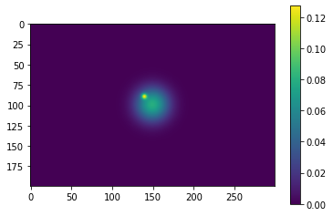
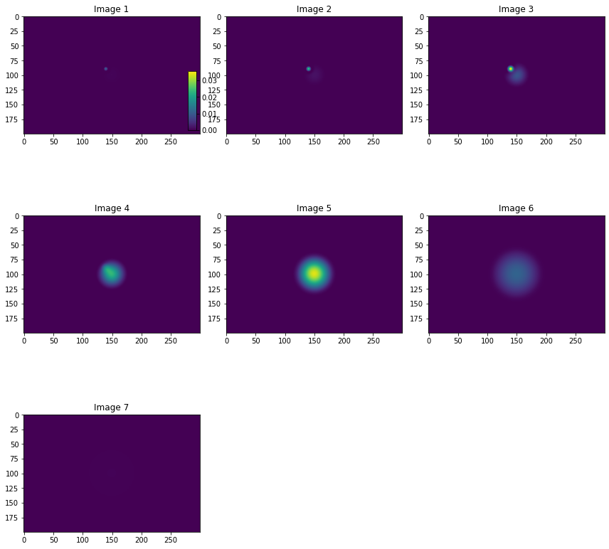
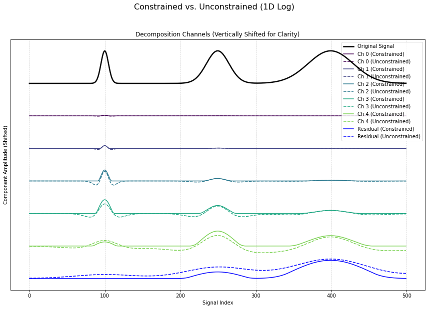
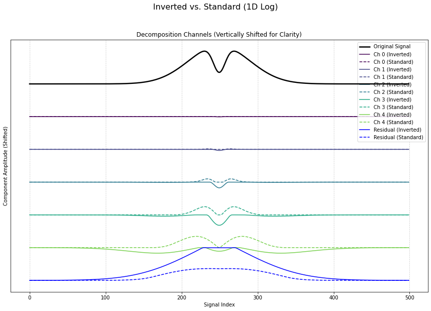
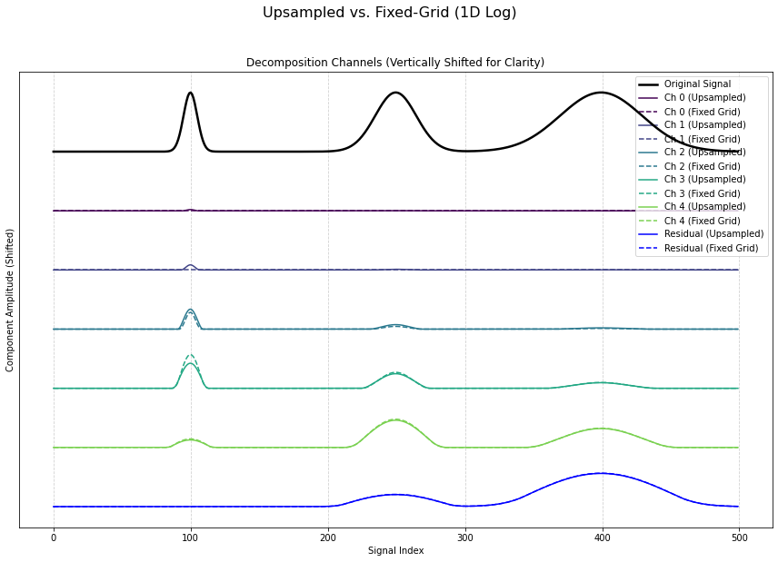
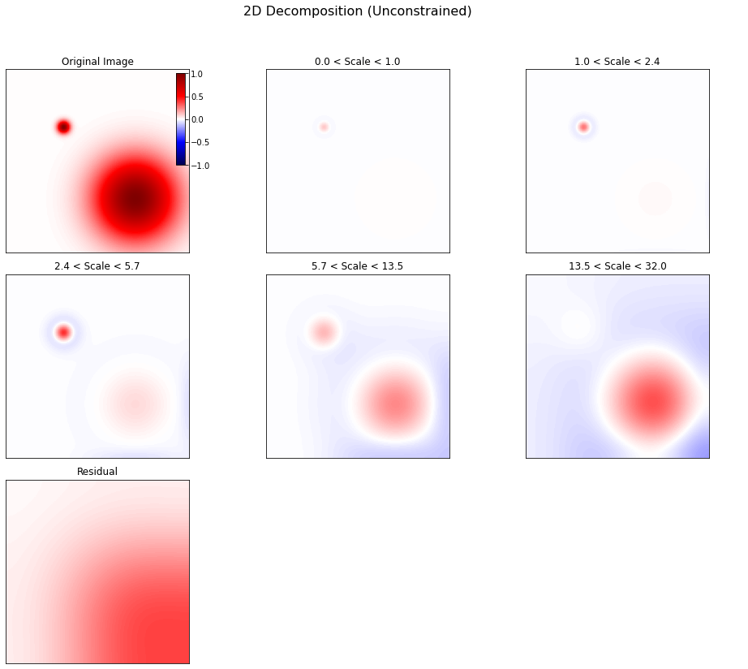
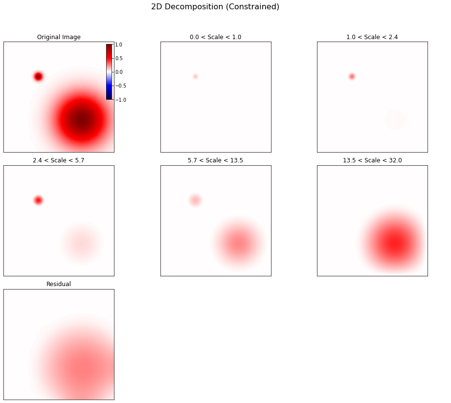

# Constrained Diffusion Decomposition: A PDE-based Image Decomposition Method

## General Design

A natural image often contains components of different scales. This project provides a tool to decompose N-dimensional `numpy.ndarray` or `torch.Tensor` data into constituent scale components.

The decomposition is highly flexible, allowing for logarithmically or linearly spaced scales that can be automatically determined from the data's shape or specified manually by the user.

The code is based on the principles described in [Li 2022, Multi-Scale Decomposition of Astronomical Maps - Constrained Diffusion Method](https://arxiv.org/abs/2201.05484).

Assuming an input of $I(x, y)$, the decomposition is achieved by solving:

$$\frac{\partial I_t }{\partial t} ={\rm sgn}(I_t) \mathcal{H}({- \rm sgn}(I_t) \nabla^2 I_t) \nabla^2 I_t$$

where the diffusion time $t$ is related to the characteristic scale $l$ by $t = l^2/2$.

### Connection to ReLU (Structural Rectification)

While the equation above uses the Heaviside step function $\mathcal{H}$, it is insightful to view this operation through the lens of modern deep learning. The constraint is mathematically equivalent to applying rectified linear unit (ReLU) logic to the curvature of the image.

For positive structures ($I > 0$), the evolution simplifies to:

$$\frac{\partial I}{\partial t} = -\text{ReLU}(-\nabla^2 I) \equiv \min(0, \nabla^2 I)$$

## Key Features

- **GPU acceleration**: Native support for CUDA and MPS through PyTorch. Decomposing large 3D volumes is significantly faster than CPU-only methods.
- **Automatic parameter detection**: Scale boundaries and the number of channels are automatically inferred from the input data's shape if not provided.
- **Hybrid upsampling strategy**: Uses a high-resolution, 4x upsampled decomposition for small scales (`<= 5` pixels) to capture fine details accurately, then switches to a standard grid for larger scales.
- **Constrained vs. unconstrained modes**:
  - **Default (`constrained=True`)**: Artifact-free, sign-preserving decomposition that prevents creation of artificial peaks or valleys.
  - **Optional (`constrained=False`)**: Standard linear diffusion, which is faster but may introduce ringing artifacts.
- **Inverted decomposition**: `inverted=True` decomposes negative features, such as holes or absorption dips, within a positive background.
- **VRAM-efficient tiling**: The GPU engine can process overlapped chunks and offload finished channels to system memory to reduce out-of-memory failures.

## Installation

From source:

```bash
git clone https://github.com/gxli/Constrained-Diffusion-Decomposition.git
cd Constrained-Diffusion-Decomposition
pip install .
```

From PyPI:

```bash
pip install constrained-diffusion
```

For GPU support, install PyTorch for your platform. This project also exposes optional GPU dependencies:

```bash
pip install ".[gpu]"
```

## Usage

The main entry point is the automated `constrained_diffusion_decomposition` function. It handles both NumPy arrays and PyTorch tensors.

### Function Signature

```python
constrained_diffusion_decomposition(
    data,
    num_channels=None,
    max_scale=None,
    min_scale=1,
    mode="log",
    log_scale_base=2.0,
    linear_scale_step=None,
    up_sample=True,
    constrained=True,
    inverted=False,
    use_gpu=False,
    device=None,
    n_chunk=1,
    n_upsample_chunk=None,
    n_overlap=2.0,
    return_scales=False,
)
```

### Key Parameters

| Parameter | Description | Default |
| :--- | :--- | :--- |
| `data` | Input N-dimensional NumPy array or PyTorch tensor. | Required |
| `mode` | Scale spacing: `"log"` or `"lin"`. | `"log"` |
| `up_sample` | If `True`, uses the efficient hybrid upsampling strategy. | `True` |
| `constrained` | If `True`, uses the artifact-free constrained algorithm. | `True` |
| `inverted` | If `True`, decomposes depressions instead of peaks. | `False` |
| `use_gpu` | If `True`, uses the PyTorch backend for hardware acceleration. | `False` |
| `device` | Target device, such as `"cuda"`, `"cuda:0"`, or `"mps"`. If `None`, auto-selects. | `None` |
| `num_channels` | Number of channels. If `None`, calculated automatically. Ignored in linear mode if `linear_scale_step` is set. | `None` |
| `max_scale` | Largest scale to analyze. If `None`, set from the data shape. | `None` |
| `min_scale` | Smallest scale to analyze. | `1` |
| `log_scale_base` | Base for logarithmic scale generation. Smaller values create finer scales. | `2.0` |
| `linear_scale_step` | Fixed step size for linear mode, overriding `num_channels`. | `None` |
| `n_chunk` | Number of overlapped tiles for fixed-grid decomposition. `1` disables tiling. On GPU, `None` enables automatic chunk planning. | `1` |
| `n_upsample_chunk` | Number of overlapped tiles for the upsampled stage. If `None`, falls back to `n_chunk`. | `None` |
| `n_overlap` | Overlap multiplier per channel scale: `overlap_pixels = ceil(n_overlap * scale_end)`. | `2.0` |
| `return_scales` | If `True`, returns the list of representative scale boundaries. | `False` |

### Output

By default, the function returns `(results, residual)`.

If `return_scales=True`, it returns `(results, residual, scales)`.

- `results`: A list of arrays. `results[i]` contains structures corresponding to `scales[i]`.
- `residual`: An array containing structures larger than the largest scale.
- `scales`: The optional list of representative scale values used for decomposition.

The original data can be recovered with:

```python
data = np.sum(results, axis=0) + residual
```

### Quickstart

```python
import constrained_diffusion as cdd
import numpy as np

data = np.random.rand(128, 128)

results, residual = cdd.constrained_diffusion_decomposition(data)

print(f"Decomposed into {len(results)} channels.")
```

GPU-enabled example:

```python
import constrained_diffusion as cdd
import numpy as np

data = np.random.rand(64, 64, 64).astype(np.float32)

results, residual = cdd.constrained_diffusion_decomposition(
    data,
    use_gpu=True,
    mode="log",
)

print(f"Decomposed into {len(results)} scale channels using GPU.")
```

## Examples

This example decomposes an image containing two Gaussian structures of different sizes using the recommended default settings.





This 1D example shows that constrained diffusion can separate a signal made of a few Gaussians without introducing negative ringing.



With `inverted=True`, diffusion fills gaps in the signal. This can be used to detect holes or absorption dips.



With `up_sample=True`, the first channels retain finer detail.



Below is a comparison between standard diffusion and constrained diffusion decomposition. The constrained version improves localization and produces a cleaner separation of the two Gaussian blobs.





## Tiling / Chunking Parameters

The updated engine supports explicit overlap-aware tiling controls:

- `n_chunk`: number of tiles for fixed-grid decomposition. `1` disables tiling.
- `n_upsample_chunk`: number of tiles for the upsampled stage.
- `n_overlap`: overlap multiplier per channel scale, where `overlap_pixels = ceil(n_overlap * scale_end)`.

On GPU (`CUDA` or `MPS`), setting `n_chunk=None` enables automatic chunk planning from available memory.

## 3D Surface Tiling Performance Test

To benchmark baseline vs. enforced tiling on a 1000x1000 mixed-scale Gaussian field and save verification plots:

```bash
python tests/test_tiling_performance_3d.py
```

To require a real GPU run with no CPU fallback:

```bash
python tests/test_tiling_performance_3d.py --gpu-only
```

Optional explicit device selection:

```bash
python tests/test_tiling_performance_3d.py --gpu-only --device cuda:0
```

This script runs:

- Baseline mode: `n_chunk=1`
- Enforced tiling mode: `n_chunk=16`

Outputs are written to:

- `tests/outputs/tiling_3d_gpu_baseline_1000x1000.png`
- `tests/outputs/tiling_3d_gpu_enforced_n16_1000x1000.png`

If no GPU accelerator is available, the script automatically runs a CPU fallback while keeping the same comparison layout.

## Reference

Li, G. (2022). Multi-Scale Decomposition of Astronomical Maps - Constrained Diffusion Method. arXiv:2201.05484.

## License

See the [LICENSE](LICENSE) file for details.
