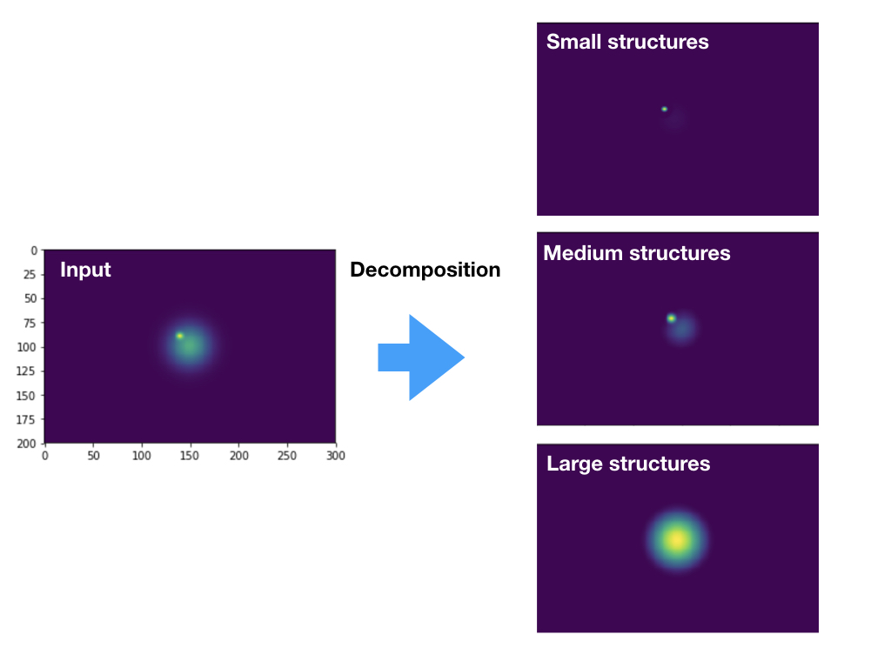
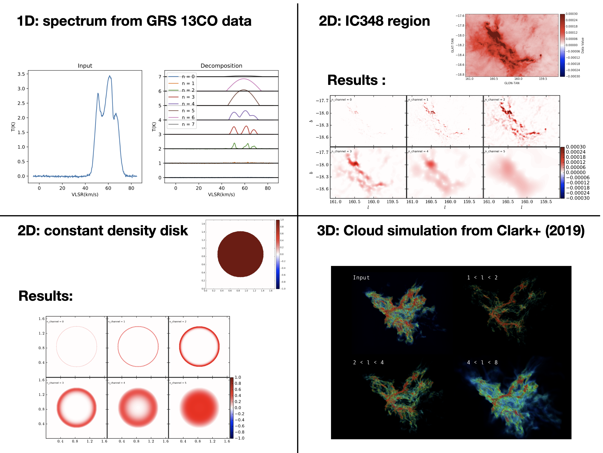

An <a href="https://github.com/gxli/Constrained-Diffusion-Decomposition/blob/main/example.ipynb"> example </a> is avaliable.

### Input:

numpy nd array, of shape e.g. (nx, ny, nz).

### Output:

result: numpy nd array, of shape (m, nx, ny, nz). The mth commponent contain structures of sizes 2$^(m-1)$ to 2$^m$ pixels. 

residual: numpy nd array, of shape (nx, ny, nz) the input data will be recovered as input = sum_i result[i] + residual.



More examples

### Usage:

### (a) under the shell
```sh
python constrained_diffusion_decomposition.py input.fits
```

the output file will be named as input.fits_scale.fits.

### (b) inside python
```python
import constrained_diffusion_decomposition as cdd

result, residual = cdd.constrained_diffusion_decomposition(data)
```

### How it is done:

Assuuming an input of I(x, y),t he decomposition is achieved by solving the equation
```math
    \frac{\partial I_t }{\partial t} ={\rm sgn}(I_t) \mathcal{H}({- \rm sgn}(I_t) \nabla^2 I_t) \nabla^2 I_t
```

where t is related to the scale l by t = l**2.

### References:

Li 2022, Multi-Scale Decomposition of Astronomical Maps -- Constrained Diffusion Method.

